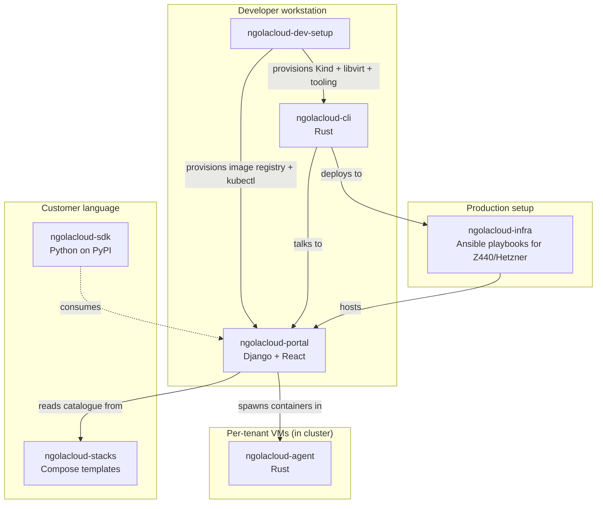
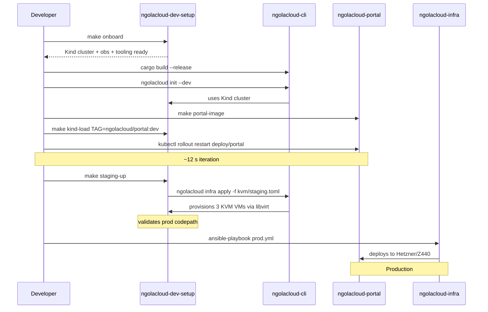

# NgolaCloud ecosystem — repository map

Where each repo lives, what it produces, and how this lab (`ngolacloud-dev-setup`)
fits into the broader picture.

## Repos

```
github.com/angolardevops/
├── ngolacloud-dev-setup          ← THIS REPO. Workstation provisioning.
├── ngolacloud-integration        ← Monorepo containing portal + CLI + agent + ...
│   ├── ngolacloud-cli            ← Rust binary (the operator's surface)
│   ├── ngolacloud-portal         ← Django + React (tenant + admin web UI)
│   ├── ngolacloud-agent          ← Per-VM Rust tunnel agent
│   ├── ngolacloud-sdk            ← Python SDK published to PyPI
│   ├── ngolacloud-stacks         ← Marketplace catalogue (compose templates)
│   └── ngolacloud-infra          ← Production host-prep + day-2 stack (Ansible)
└── docs/                         ← Public-facing documentation
```

## Functional separation



## Per-repo summary

| Repo | Language | Role | Where it runs |
|---|---|---|---|
| **`ngolacloud-dev-setup`** | Ansible + Bash | Provisions the **developer's workstation** as a working Kind+libvirt lab | Operator's laptop only |
| `ngolacloud-cli` | Rust | The `ngolacloud` binary — primary operator surface (`infra apply`, `platform deploy`, `publish`, ...) | Operator's laptop + CI |
| `ngolacloud-portal` | Django + React | Tenant portal + admin operations console | Inside the K8s cluster |
| `ngolacloud-agent` | Rust | Per-VM tunnel agent that bridges tenant VMs to the platform | Inside each tenant VM |
| `ngolacloud-sdk` | Python | Third-party API client (published to PyPI) | Customer environments |
| `ngolacloud-stacks` | YAML / JSON | Marketplace catalogue — compose / Helm templates | Read from K8s ConfigMap; rendered by `ngolacloud-cli` |
| `ngolacloud-infra` | Ansible | **Production** host prep (kernel tuning, libvirt setup, kubeadm, MetalLB) + day-2 stack (Loki, ArgoCD, ...) | Z440 / Hetzner / T5600 |

## Tier-aware repo relationships

The lab's Tier 0–12 maps to who needs it:

| Tier (lab) | Who relies on it | Why |
|---|---|---|
| 0–1 (host tuning) | All workstation users | Cannot run a useful Kind cluster without it |
| 2 (Kind + Cilium) | `ngolacloud-cli`, `ngolacloud-portal` | Both deploy to the lab cluster |
| 3 (Rust toolchain) | `ngolacloud-cli`, `ngolacloud-agent` | Both Rust workspaces depend on sccache + mold |
| 4 (docs + benchmark) | Anyone joining the team | Onboarding |
| 5 (nested KVM staging) | `ngolacloud-cli` | The only way to validate `infra apply` end-to-end before `ngolacloud-infra` runs it on real metal |
| 6 (CI + WireGuard) | All repos | Same lint gates expected to mirror across the ecosystem |
| 7 (obs + onboard + secrets) | `ngolacloud-portal` (metrics), all (Vault) | The portal exposes /metrics; everything reads secrets via sops or Vault |
| 8 (GitOps + Kyverno + DR) | `ngolacloud-portal` deploy | Flux reconciles the Helm chart; Kyverno enforces PSS |
| 9 (Trivy + Falco + opencost) | Every container shipped | Continuous scan + threat detection |
| 10 (Cosign + verifyImages) | `ngolacloud-cli`, `ngolacloud-portal` | Both ship signed images; cluster rejects unsigned ones |
| 11 (ESO + chaos + SLSA L3) | `ngolacloud-portal` (ESO consumer), chaos targets the portal | Validates portal resilience + secret rotation |
| 12 (Molecule + smoke + release) | The lab itself | Self-maintaining quality |

## Information flow at a glance



## Where to look when something breaks

| Symptom | First place to look |
|---|---|
| `make onboard` fails on host preflight | `docs/troubleshooting.md` (this repo) |
| Kind cluster up but portal won't deploy | `ngolacloud-portal/CLAUDE.md` (sibling repo) — Helm chart specifics |
| `ngolacloud infra apply` fails on KVM | `kvm/staging-cluster.toml` validation + `docs/adr/0004-nested-kvm-staging.md` |
| CVE on a portal image | `kubectl get vulnerabilityreports -n ngolacloud` (Tier 9 Trivy operator) |
| Pod admission rejected | `kubectl get policyreports -A` (Kyverno) — `docs/adr/0008` |
| Image rejected at admission | Cosign signature missing — `docs/adr/0009` |
| Grafana dashboard blank | `loki-stack` healthy? `kubectl -n observability get pods` |
| Cluster forgot a configmap | `make dr-restore FILE=...` (Tier 8 DR drill) |

## When to graduate work into `ngolacloud-infra`

The lab is for **the laptop**. Production tuning lives in
`ngolacloud-infra` (separate repo). When you find a host knob that
makes a real difference, port it:

1. Edit the lab role (e.g. `ansible/roles/system_tuning/tasks/main.yml`)
2. Validate via `make molecule-test`
3. Open a sibling PR in `ngolacloud-infra` mirroring the change
4. Run the prod playbook against Z440 staging before promoting

The two repos **deliberately diverge** on storage / networking / HA, but
**deliberately converge** on kernel / cgroup / containerd / Cilium /
Kyverno. The shared layer is the contract.
