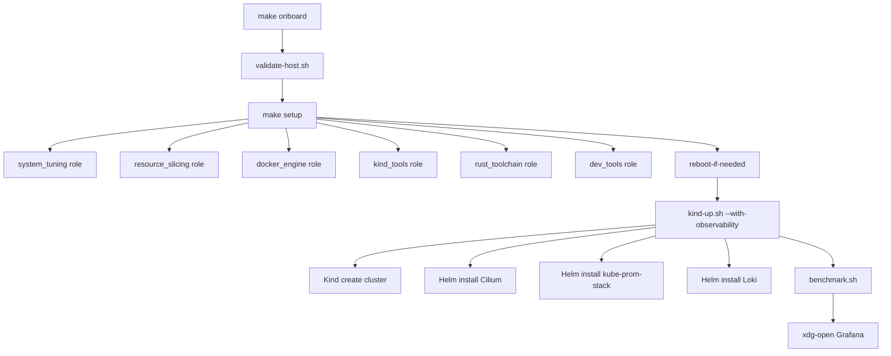

# Onboarding — `ngolacloud-dev-setup`

Welcome. This guide takes you from **fresh laptop** to **production-grade
NgolaCloud dev lab** in ~30 minutes. If you're stuck after step 5, jump
to [Troubleshooting](troubleshooting.md).

---

## 0. Who this lab is for

| Persona | Why you're here |
|---|---|
| **App dev** | Build + deploy NgolaCloud microservices against a real K8s cluster locally (Kind + Cilium + ingress) |
| **SRE** | Prove DR drill, run chaos experiments, observe via Grafana, scan with kube-bench |
| **Platform engineer** | Validate Kyverno policies, GitOps reconciliation, supply-chain signatures |
| **Cloud architect** | Test `ngolacloud infra apply` end-to-end on nested KVM before Hetzner |
| **SecOps** | 4-layer defence-in-depth (admission, scan, runtime, supply chain) ready to use |

---

## 1. Prerequisites

You need (run `make validate` to verify):

- **OS**: Zorin 18.x or Ubuntu 24.04+ (kernel 6.x with cgroup v2)
- **CPU**: ≥ 8 cores; ideal 16+ (CPU virt enabled in BIOS if you want nested KVM)
- **RAM**: ≥ 32 GB (lab needs 32 GB slice + system; 64 GB recommended)
- **Disk**: ≥ 100 GB free on `/`
- **sudo** access (NOPASSWD makes onboarding 1-shot; otherwise prompts per task)
- **ansible** ≥ 2.16 (`apt install ansible`)
- **Internet** reachable to `download.docker.com`

Optional (Tier 5+):
- **BIOS virtualisation** flags exposed (`vmx`/`svm` in `/proc/cpuinfo`)

---

## 2. The 30-minute happy path

```bash
# 1. Clone the lab
git clone https://github.com/angolardevops/ngolacloud-dev-setup
cd ngolacloud-dev-setup

# 2. Sanity check (no sudo, no writes)
make validate                       # exit 0 = ready, 1 = warn, 2 = abort

# 3. Full bootstrap (one shot — answers Y to everything sensible)
make onboard                        # ~15 min: host + cluster + Grafana

# 4. Verify
make health                         # 8-row table, all ✓
xdg-open http://localhost:3000      # Grafana — admin / ngolacloud-dev
```

If you prefer step-by-step instead of `make onboard`:

```bash
make setup-check                    # ansible dry-run (--check --diff)
make setup                          # apply (~10 min)
make reboot-if-needed               # only reboots if GRUB changed
make kind-up WITH_OBS=1              # cluster + Cilium + prom/grafana/loki
make health
```

---

## 3. What just happened (the 12 tiers)

The lab installs in **layers**, each opt-in and reversible:

| Tier | What it installs | Make target |
|---|---|---|
| 0 | Disk + Kind cluster housekeeping (cleanup, prune) | — |
| 1 | Host tuning (sysctls, GRUB THP, udev, swap, slice) | `make setup TAGS=system,slice,docker` |
| 2 | Kubernetes tooling (kind, kubectl, helm, k9s, stern) | `make setup TAGS=kind` |
| 3 | Rust toolchain (rustup + sccache + mold) + dev tools | `make setup TAGS=rust,tools` |
| 4 | Docs + benchmark | — |
| 5 | Nested KVM staging (libvirt + qemu) | `make setup TAGS=kvm` |
| 6 | CI lint workflow + WireGuard + LICENSE | `make setup TAGS=wireguard` |
| 7 | Observability (Prometheus + Grafana + Loki) | `make kind-up WITH_OBS=1` |
| 8 | Kyverno policies + DR drill + Flux GitOps | `make kyverno-install`, `make flux-install-sample`, `make dr-drill` |
| 9 | Trivy Operator + kube-bench + Falco + opencost | `make security-stack` |
| 10 | Cosign + Kyverno verifyImages (SLSA L2) | `make supply-chain-stack` |
| 11 | External Secrets + chaos-mesh + SLSA L3 | `make resilience-stack` |
| 12 | Molecule tests + smoke CI + release automation | `make molecule-test` (per role) |

The full call graph:



---

## 4. Project structure at a glance

```
ngolacloud-dev-setup/
├── README.md                   # 5-step quickstart + Makefile map
├── CHANGELOG.md                # SemVer log per tier
├── LICENSE                     # Apache 2.0
├── Makefile                    # 60+ targets — the entry point
├── .envrc / .envrc.template    # direnv per-project env (KUBECONFIG, sccache, ...)
├── .pre-commit-config.yaml     # local lint gate
├── .sops.yaml.template         # secret encryption rules
├── ansible/                    # Tier 0-6 — host provisioning
│   ├── ansible.cfg
│   ├── inventory.ini           # pinned versions
│   ├── setup.yml               # playbook entry
│   └── roles/                  # 8 roles (4 default + 4 opt-in)
├── kind/                       # Tier 2 + 7 — Kind cluster config
│   ├── cluster-dev.yaml
│   ├── cilium-values.yaml
│   └── observability-values.yaml
├── kvm/                        # Tier 5 — nested staging
│   ├── staging-cluster.toml
│   └── cloud-init-user-data.yml.template
├── k8s/                        # Tier 8-11 — in-cluster manifests
│   ├── policies/kyverno/       # 4 PSS ClusterPolicies
│   ├── supply-chain/           # verifyImages L2 + L3
│   ├── security/               # trivy/kube-bench/falco/opencost values
│   ├── secrets/                # ESO ClusterSecretStore + sample
│   ├── chaos/                  # 3 chaos-mesh experiments
│   ├── flux/                   # GitOps sample
│   └── portal-chart/           # reference Helm chart for apps
├── scripts/                    # 18 shell helpers
│   ├── _common.sh              # shared log + wait helpers
│   ├── validate-host.sh        # preflight (no sudo)
│   ├── onboard.sh              # one-shot orchestrator
│   ├── kind-up.sh              # + --with-observability
│   ├── kind-down.sh
│   ├── kind-load-image.sh      # build + load into Kind nodes
│   ├── health-check.sh         # 8-row status table
│   ├── benchmark.sh            # JSON or human-friendly timings
│   ├── kyverno-install.sh      # + --enforce / --uninstall
│   ├── dr-drill.sh             # snapshot | restore | full
│   ├── flux-install.sh         # --bare / --sample / --uninstall
│   ├── security-scan.sh        # trivy + bench + report aggregator
│   ├── falco-install.sh        # + --test (netcat trigger)
│   ├── opencost-install.sh     # + --report (AOA cost breakdown)
│   ├── cosign-setup.sh         # sign/verify/attest + policy apply
│   ├── eso-install.sh          # + --with-vault
│   └── chaos-install.sh        # + --apply / --target / --status
├── docs/
│   ├── onboarding.md           # this file
│   ├── ecosystem.md            # repo map across NgolaCloud
│   ├── integration-with-ngolacloud-portal.md
│   ├── integration-with-ngolacloud-cli.md
│   ├── divergence-from-prod.md # 20% Kind doesn't validate
│   ├── troubleshooting.md      # top 10 failures
│   ├── commands-reference.md   # exhaustive Make + script ref
│   ├── file-structure.md       # annotated tree
│   └── adr/                    # 11 architectural decision records
└── .github/workflows/          # 5 CI workflows
    ├── lint.yml                # ansible-lint + shellcheck + yamllint
    ├── trivy.yml               # fs + config scan + SBOM
    ├── kube-bench.yml          # weekly CIS drift detector
    ├── smoke.yml               # E2E on a fresh runner
    └── release.yml             # tag v* → GitHub Release
```

---

## 5. The 5 commands you actually use daily

After `make onboard` succeeds, these are the only ones you need:

| Command | When |
|---|---|
| `make kind-load TAG=ngolacloud/portal:dev` | After every `docker build` of an app you're iterating on |
| `kubectl -n ngolacloud rollout restart deploy/portal` | After loading a new image, to pick up the change |
| `make health` | Random "is the lab fine?" check |
| `make security-report` | Weekly "what's burning?" rollup |
| `make kind-down && make kind-up WITH_OBS=1` | Nuclear reset — when the cluster is in a weird state |

Optional but useful:

| Command | When |
|---|---|
| `make dr-drill` | Before promoting a release (proves restore works) |
| `make falco-tail` | Investigating a security incident |
| `make opencost-report` | Monthly cost review in AOA |
| `make staging-up` | Validating `ngolacloud infra apply` against real KVM VMs |

---

## 6. Integrating with `ngolacloud-integration`

The lab is **the infrastructure**. The actual NgolaCloud applications
live in a sibling monorepo:

```
~/workspaces/delonix/
├── ngolacloud-dev-setup/          ← this repo (workstation provisioning)
└── ngolacloud-lab/
    └── ngolacloud-integration/    ← the apps
        ├── ngolacloud-cli/        ← Rust CLI (operator surface)
        ├── ngolacloud-portal/     ← Django + React (web UI)
        ├── ngolacloud-agent/      ← Per-VM Rust tunnel agent
        ├── ngolacloud-sdk/        ← Python SDK on PyPI
        ├── ngolacloud-stacks/     ← Marketplace catalogue
        └── ngolacloud-infra/      ← Production Ansible playbooks
```

### Wiring the portal to the lab cluster

```bash
# 1. The lab cluster MUST be up first
cd ~/workspaces/delonix/ngolacloud-dev-setup
make kind-up WITH_OBS=1

# 2. Build the portal image (in the integration repo)
cd ~/workspaces/delonix/ngolacloud-lab/ngolacloud-integration/ngolacloud-portal
docker build -t ngolacloud/portal:dev .

# 3. Load the image into the lab cluster
cd ~/workspaces/delonix/ngolacloud-dev-setup
make kind-load TAG=ngolacloud/portal:dev

# 4. Install the portal Helm chart (using the lab's reference chart)
helm install portal-dev k8s/portal-chart \
  --namespace ngolacloud --create-namespace \
  --set image.tag=dev

# 5. Seed demo data inside the portal pod
POD=$(kubectl -n ngolacloud get pod -l app.kubernetes.io/name=ngolacloud-portal -o name | head -1)
kubectl -n ngolacloud exec "$POD" -- python manage.py seed_demo
# → creates 13 tenants + 8 containers proportional to host capacity
```

### Wiring the CLI to the lab

The Rust CLI just needs the lab's Kind cluster to exist:

```bash
cd ~/workspaces/delonix/ngolacloud-lab/ngolacloud-integration/ngolacloud-cli
cargo build --release                    # uses sccache + mold from Tier 3

# `ngolacloud init --dev` discovers ~/.kube/config and the kind cluster
./target/release/ngolacloud init --dev
./target/release/ngolacloud platform status
```

For prod codepath validation (the killer feature):

```bash
cd ~/workspaces/delonix/ngolacloud-dev-setup
make setup TAGS=kvm                      # one-time: libvirt + qemu
make staging-up                          # CLI spins up 3 KVM VMs locally
```

This runs the SAME kubeadm + Cilium + containerd + cloud-init flow as
real prod (Z440 / Hetzner) — just on your laptop's KVM stack.

### Where to commit work

| Change type | Repo | Branch |
|---|---|---|
| Bash script / Ansible role for the lab | `ngolacloud-dev-setup` | `main` (or feature branch) |
| Django app code, React component | `ngolacloud-integration/ngolacloud-portal/` | `1.0` (current convention) |
| Rust CLI subcommand | `ngolacloud-integration/ngolacloud-cli/` | `1.0` |
| Production Ansible playbook | `ngolacloud-integration/ngolacloud-infra/` | `main` |

---

## 7. Day-2 workflows

### Hot-reload loop (the lab's killer feature)

```bash
# Edit code in your editor
cd ~/workspaces/delonix/ngolacloud-lab/ngolacloud-integration/ngolacloud-portal

# Build + load + restart — ~12s on the reference workstation
make portal-image                       # docker build
cd ~/workspaces/delonix/ngolacloud-dev-setup
make kind-load TAG=ngolacloud/portal:dev
kubectl -n ngolacloud rollout restart deploy/portal-dev
```

Watch the new pod come up:

```bash
stern -n ngolacloud portal-dev          # tail logs while it rolls
```

### Before opening a PR

```bash
# 1. Run all local linters (same as CI)
make lint                               # ansible-lint + shellcheck + yamllint

# 2. Run molecule tests on roles you touched
make molecule-test                      # currently covers system_tuning

# 3. Re-run health check
make health
```

### Cutting a release

```bash
# 1. Update CHANGELOG.md with the new version
$EDITOR CHANGELOG.md

# 2. Commit + push the changelog
git add CHANGELOG.md
git commit -m "release: v1.2.0"
git push origin main

# 3. Tag + push
git tag -a v1.2.0 -m "Tier X release"
git push origin v1.2.0

# The release.yml workflow:
#   - Extracts the v1.2.0 entry from CHANGELOG.md
#   - Generates a fresh Trivy SBOM
#   - Creates a GitHub Release with the SBOM + tarball
```

---

## 8. Mental model — three layers of trust

```
┌─────────────────────────────────────────────────────────────────────┐
│                     LAYER 3 — Cluster admission                       │
│   Kyverno policies (PSS Baseline + Restricted + verifyImages)         │
│   Falco runtime detection                                              │
├─────────────────────────────────────────────────────────────────────┤
│                     LAYER 2 — Build-time gates                        │
│   Trivy fs/config/SBOM scan (CI) · Cosign sign + attest               │
├─────────────────────────────────────────────────────────────────────┤
│                     LAYER 1 — Source                                  │
│   pre-commit hooks · sops/age encrypted secrets · semantic commits    │
└─────────────────────────────────────────────────────────────────────┘
```

A change that survives all three layers is safe to ship to prod.

---

## 9. Where to read more

| Topic | Doc |
|---|---|
| Every make target explained | [`commands-reference.md`](commands-reference.md) |
| Every file in the repo | [`file-structure.md`](file-structure.md) |
| How this repo connects to the rest | [`ecosystem.md`](ecosystem.md) |
| Portal-specific wiring | [`integration-with-ngolacloud-portal.md`](integration-with-ngolacloud-portal.md) |
| CLI-specific wiring | [`integration-with-ngolacloud-cli.md`](integration-with-ngolacloud-cli.md) |
| What dev doesn't validate (the 20%) | [`divergence-from-prod.md`](divergence-from-prod.md) |
| Top 10 failure modes | [`troubleshooting.md`](troubleshooting.md) |
| Why kind, why Cilium, why mold, ... | [`adr/`](adr/) (11 ADRs) |

---

## 10. Getting help

1. **`make help`** — every target, one-liner descriptions
2. **`./scripts/<script>.sh --help`** — every script has a usage block
3. **GitHub issues** — file at `angolardevops/ngolacloud-dev-setup`
4. **Engineering Discord** — `#ngolacloud-dev` channel
5. **Last resort**: `make uninstall && rm -rf ~/workspaces/delonix/ngolacloud-dev-setup`
   and clone fresh — the lab is designed for ephemeral reinstall

Welcome aboard 🇦🇴
